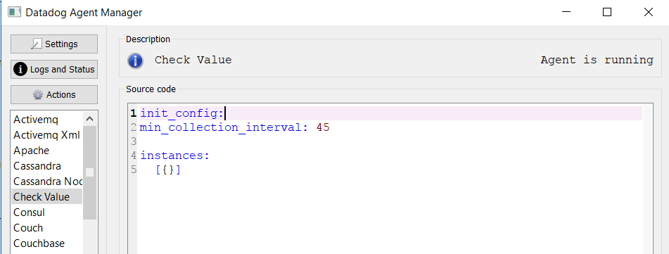

Your answers to the questions go here.
Your answers to the questions go here.

## Prerequisites - Setup the environment:

All the  work was done on a windows 10.
We need to sign up for Datadog using “Datadog Recruiting Candidate” in the “Company” field.

## Collecting Metrics:

Tags are mostly used  for  filtering and  search purpose.
To add tags, we need  to open the agent config  file ( we could open it  through the data agent manager then click on settings) then add tags.

we can find the added tags in `Infrastructure -> Host Map`.

Install a database on your machine (MySQL) and then install the respective Datadog integration for that database.

To create a custom Agent check that submit mits a metric named my_metric with a random value between 0 and 1000, we need  to create two files: [check_value.yaml ](./code/check_value.yaml) & [check_value.py](./code/check_value.py) ( the two files need  to have the same name).

To change the check's collection interval so that it only submits the metric once every 45 seconds, we need  to change DEFAULT_MIN_COLLECTION_INTERVAL to 45 in the  file [__init__.py](./code/__init__.py)

* **Bonus Question**: Can you change the collection interval without modifying the Python check file you created?

We can change the collection interval through the [YAML](./code/YAML.yaml) file.

## Visualizing Data:

We created  a timeboard by clicking  on `Dashboards -> new Dashboard` then we  customize our dashboard.

First we want to display my_metric scoped over our host.

Then we want to display a database metric with the anomaly function applied.

Finally, we want to display my metric with the rollup function applied to sum up all the points for the past hour.

We could fine  our  custom dashboards in the  Dashboard List.

We can set the timeboard’s timeframe by selection on the chart the  period we want to show and sent a snapshot via email through using the tools in the left.

We are able  to add a comment and sent it via email through using  @ + email.

* **Bonus Question**: What is the Anomaly graph displaying?

Anomaly detection is an algorithmic feature that allows you to identify when a metric is behaving differently than it has in the past. 
So anomaly graph will display when a metric is behaving differently. For example when the connection to database is missed.

## Monitoring Data:

To monitoring data, we could create  a  new metric  monitor by clicking  on "Monitors -> New Monitor" then select a monitor type.

In our case, we will create  new Metric Monitor that watches the average of your custom metric (my_metric) and will alert if it’s above the following values over the past 5 minutes:

*	Warning threshold of 500.
*	Alerting threshold of 800.
*	And also ensure that it will notify you if there is No Data for this query over the past 10m.

We could also configure the  monitor’s message  so that it will:

*	Send you an email whenever the monitor triggers. ( define which email or member team should be notified)
*	Create different messages based on whether the monitor is in an Alert, Warning, or No Data state.(define the  kind  of message through writing {{# command }})
*	Include the metric value that caused the monitor to trigger and host ip when the Monitor triggers an Alert state.(different attributes could be  used for example: metric  value = “{{value}}” and host ip = {{host.ip}})

(The ip host is blank because it’s not define)

* **Bonus Question**: 

To set up scheduled downtime, we need  to go to “Monitors -> Manage Downtime".

We will create two scheduled downtimes for this monitor:

*	One that silences it from 7pm to 9am daily on M-F:

*	And one that silences it all day on Sat-Sun:

*	We receive also notification for scheduled downtimes:

## Collecting APM Data:

There are several ways to set up application performance monitor.
We implemented Flask as a service (however, it doesn’t work as expected).

* **Bonus Question**: What is the difference between a Service and a Resource?
Service is a main process which aims to do particular thing. 
Resource are element or part of the service. 
Resource are used by the service to do particular thing.

## Final Question:
I think that datadog could really help in monitoring real time applications. Such applications are vulnerable and could always face anomalies. Even if  new technologies aim to decrease the system vulnerability, monitoring solution could  help for rapid intervention and to avoid  losses and catastrophes.
I think that datadog is a good  solution to monitoring bank systems or sap system to avoid the case where the bank services are not available or to detect when servers go down to avoid  work interruption  for sap systems.

